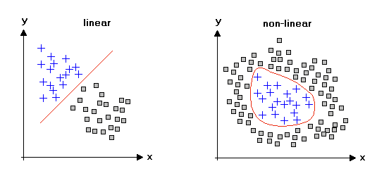
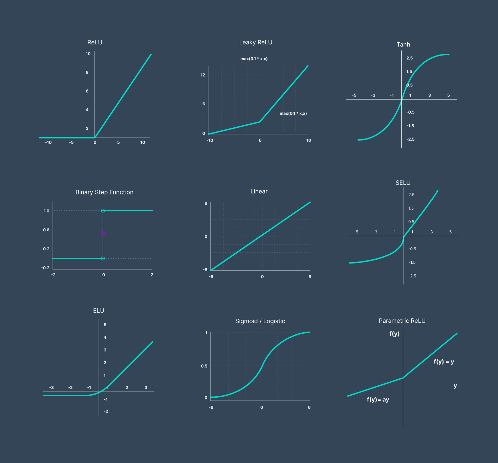

##  What is a Linear Function?

* A **linear function** is one where the output is a straight-line combination of inputs.
* General form:

$$
f(x) = w \cdot x + b
$$

where

* $x$ = input(s) (scalar or vector),
* $w$ = weight(s),
* $b$ = bias (shifts the line up/down),
* $\cdot$ = dot product when $x$ is a vector.

---

##  Role in Neural Networks

1. **Linear Transformation Layer**

   * Each neuron computes a **linear function of the input**:

   $$
   z = w_1x_1 + w_2x_2 + \dots + w_nx_n + b
   $$

   * This is the building block of every layer.

2. **Stacking Linear Layers Alone is Useless**

   * If you only stack linear functions, the result is still **linear**.
     (E.g., $f(x) = W_2(W_1x)$ = another linear transformation).
   * That’s why **activation functions (non-linearities)** are added — they give neural nets the power to model complex relationships.

3. **Interpretability**

   * In simple models (like linear regression or a single-layer perceptron), the weights directly show the **importance of each input feature**.
   * Example: in spam detection, if the weight for the word “FREE” is high, that feature strongly pushes the decision toward "spam".

---

##  In AI Applications

* **Linear Regression** → predicts continuous outcomes with a straight line (or hyperplane).
* **Logistic Regression** → applies a **linear function** followed by a non-linear sigmoid to model probabilities.
* **Neural Networks** → use linear functions to project and combine features, then apply non-linear activations.
* **Embeddings & Transformers** → linear layers (matrices) are used heavily for projection, mixing, and transformations of high-dimensional data.

---

##  Key Properties

* **Efficient to compute**: just multiplications + additions.
* **Easy to optimize**: convex in simple cases (like linear regression).
* **Limited power alone**: can’t model curved or complex patterns without non-linearity.

---

 **In short:**
Linear functions are the **fundamental building blocks** of neural networks — they weight and combine inputs. By themselves, they’re limited (only straight-line relationships). But when combined with **non-linear activation functions**, they allow networks to learn complex mappings and representations, which is what gives AI its real power.

