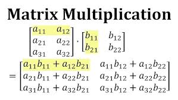
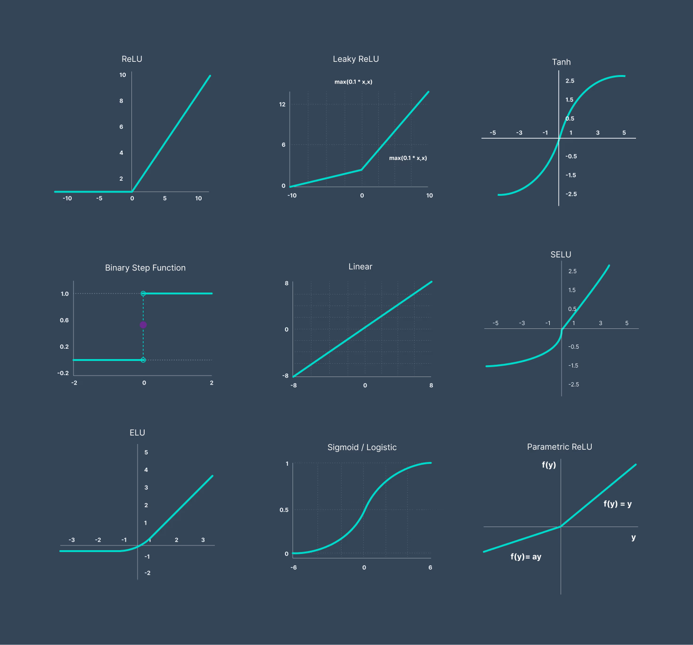

Perfect — let’s cover **non-linear functions in neural networks (NNs)** with a crisp but thorough summary:

---

##  What is Non-Linearity?

* A **non-linear function** is one where the output does *not* change proportionally with the input.
* Examples: ReLU, Sigmoid, Tanh, GELU, Swish.
* Non-linear functions allow neural networks to capture **curves, interactions, and complex patterns** instead of just straight lines.

---

##  Role in Neural Networks

1. **Activation Functions = Non-Linearity**

   * After each linear transformation ($z = Wx + b$), a **non-linear activation function** is applied:

   $$
   a = \sigma(z)
   $$

   * This breaks the “just another linear function” problem.
   * Without them, stacking layers is no better than one linear layer.

2. **Why We Need Them**

   * Real-world data (images, speech, text, medical signals, stock trends, etc.) is **not linearly separable**.
   * Non-linear functions let the network approximate **any function** (Universal Approximation Theorem).

3. **Feature Transformation**

   * Each non-linearity reshapes the feature space.
   * For example, in classification:

     * Linear only → separates with straight lines.
     * Linear + non-linear → can separate with curves and complex decision boundaries.

---

##  Common Non-Linear Functions

| Function                         | Formula                                 | Key Behavior                                                                        |
| -------------------------------- | --------------------------------------- | ----------------------------------------------------------------------------------- |
| **Sigmoid**                      | $\sigma(x) = \frac{1}{1+e^{-x}}$        | Squashes values to \[0,1], good for probabilities; can cause vanishing gradients.   |
| **Tanh**                         | $\tanh(x)$                              | Squashes to \[-1,1]; stronger gradients than sigmoid but still can vanish.          |
| **ReLU**                         | $\max(0, x)$                            | Simple, efficient, avoids vanishing gradient for positive values; most widely used. |
| **Leaky ReLU / Parametric ReLU** | Like ReLU but small slope for negatives | Helps avoid “dead neurons.”                                                         |
| **GELU, Swish**                  | Smooth modern activations               | Often outperform ReLU in deep nets (e.g., Transformers).                            |

---

##  In AI Applications

* **Computer Vision** → ReLU dominates (deep CNNs).
* **NLP / Transformers** → GELU or Swish for smoother gradients.
* **Classification** → sigmoid (binary), softmax (multi-class) as final activation.
* **Generative Models** → use tanh or other smooth activations in output layers for stable generation.

---

##  Key Properties

* **Enable complexity**: Let the network learn curved/complex decision boundaries.
* **Gradient flow**: Good non-linear functions keep gradients stable (avoid vanishing/exploding).
* **Task-specific choice**: Some are better for certain domains (ReLU vs GELU, sigmoid for probabilities).

---

 **In short:**
Non-linear functions (activations) are what give neural networks their real power. Linear layers combine features, while non-linearities allow the model to learn **complex, flexible, non-straight-line relationships** — making neural networks capable of solving problems far beyond what linear models can do.

